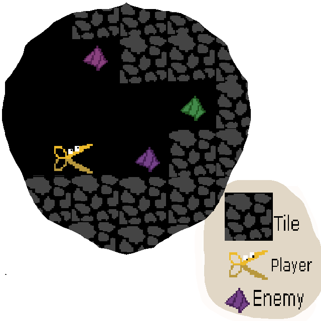
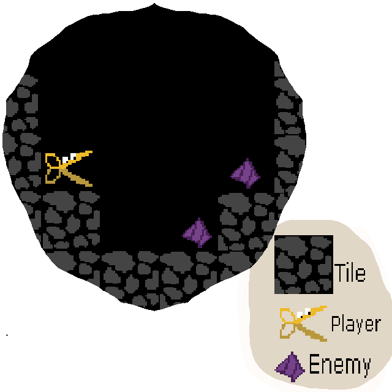
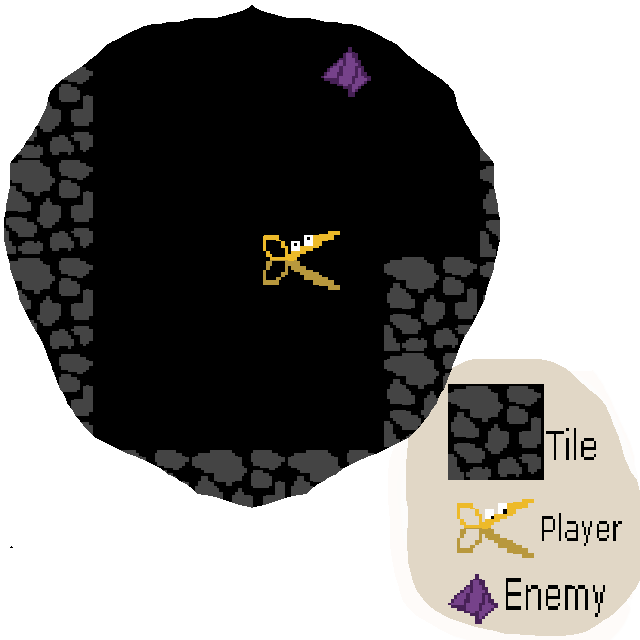

# M3BO---Pacman

Module 3 Beroeps Opdracht - Pacman game

2.2 :
    Ontwerp de eerste 30 seconden van jouw game als een tutorial zonder tekst.

Ik wist meteen dat ik een pixel-artstyle wou gebruiken, en ben voor een 64x64 textuur gegaan omdat ik wel wat detail wou, maar niet te veel. Ik besloot ook om het contrast van de originele Pacman te houden; donkere achtergronden en felle kleuren voor de player en enemies.

Deze opdracht was impercipe best makkelijk, al had ik een beetje moeite met alles netjes op een grid te houden.